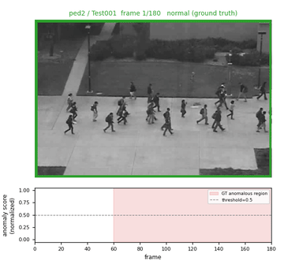
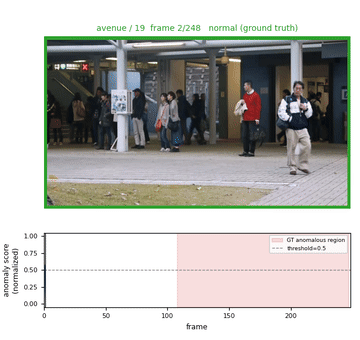

# Streaming Video Anomaly Detection with a Causal State-Space Core

A strictly causal, O(1)-per-frame streaming video anomaly detector. A frozen visual backbone feeds a lightweight causal state-space (SSM) temporal core with a learned "event-boundary" decay gate, trained self-supervised via next-frame-embedding prediction. Built for real-time inference on commodity edge hardware (developed and benchmarked on an Apple M3 Pro, MPS backend, no CUDA dependency).

## Demo

Real, unedited model output: raw frame, green/red border for the ground-truth label, and the actual streaming anomaly score scrolling underneath (true anomalous region shaded). Not cherry-picked: the Ped2 clip shows real false positives, consistent with its 67.9% AUC below.




UCSD Ped2 `Test001` (left) and CUHK Avenue clip `19` (right). MP4 versions with playback controls: [`ped2_Test001.mp4`](assets/qualitative/ped2_Test001.mp4), [`avenue_19.mp4`](assets/qualitative/avenue_19.mp4). Regenerate or render a different clip:

```bash
python scripts/make_qualitative_video.py --dataset ped2 --clip Test001
```

## Why this exists

2025 saw several papers apply Mamba/SSMs to video anomaly detection, so "SSM for VAD" alone isn't novel. None of that prior work provides:

1. A **strict streaming formulation**: O(1) state, zero lookahead, no clip buffering (prior work still buffers clips internally).
2. A **theoretical link** between the SSM's decay spectrum and detection delay / minimum-detectable event duration.
3. **Real edge-hardware measurements**: latency, memory, and throughput on actual consumer silicon, not GPU throughput claims.

`src/train.py` / `src/evaluate.py` produce the accuracy numbers; `scripts/analyze_theory.py` plus the latency instrumentation in `evaluate.py` produce the theory-validation and deployment evidence.

## Results

Run end-to-end on UCSD Ped2 and CUHK Avenue (download, prepare, extract features, train, evaluate, theory validation), with default, untuned hyperparameters:

| Dataset | Frame-AUC | EER | Latency (M3 Pro) | FPS |
|---|---|---|---|---|
| UCSD Ped2 | 67.9% | 36.8% | 0.74 ms | 1344 |
| CUHK Avenue | 70.2% | 34.9% | 0.77 ms | 1291 |

These AUCs are well below published SOTA on these benchmarks (~95-99% on Ped2), expected from an untuned first pass with vanilla frozen ResNet-18 features and no fine-tuning. It shows the pipeline is correct end-to-end, not that the method is competitive yet.

**Theory validation**: the fixed-decay settling-delay bound predicts ~58 frames from the learned base decay alone, but measured detection delay is far shorter (1.6 frames on Ped2, 18.4 on Avenue), meaning the event-boundary gate, not the base decay, governs reaction speed.

**Ablations** (`scripts/make_ablation_table.py`) turned up a real finding: the gate's effect on accuracy flips sign between datasets. Disabling it improves Ped2 (76.6% vs. 67.9%, smaller training set, looks like overfitting) but hurts Avenue sharply (60.0% vs. 70.2%, larger training set). Combining each dataset's two individually-helpful changes doesn't stack; both combined configs land back near baseline. Consistent with a capacity/data-size interaction, though it's a two-dataset hypothesis. ShanghaiTech (a third, larger dataset) is the natural next check; not yet run (large multi-part archive, only 1 of 7 parts obtained so far).

### Reproduce these numbers

The trained checkpoints behind the table above are committed at `checkpoints/ped2/latest.pt` and `checkpoints/avenue/latest.pt` (~2.5MB each), so reproducing them doesn't need retraining, just the datasets prepared (see Dataset preparation below) and cached features:

```bash
python scripts/extract_features.py --config configs/ped2.yaml
python -m src.evaluate --config configs/ped2.yaml --checkpoint checkpoints/ped2/latest.pt --save-scores

python scripts/extract_features.py --config configs/avenue.yaml
python -m src.evaluate --config configs/avenue.yaml --checkpoint checkpoints/avenue/latest.pt --save-scores
```

Each prints frame-AUC, EER, and on-device latency/FPS matching the table exactly (evaluation is deterministic given a fixed checkpoint). For the theory-validation and ablation numbers, run `scripts/analyze_theory.py` against the same checkpoints, and see Usage below for `--override`/`--tag` to reproduce or extend the ablation sweeps (those checkpoints aren't committed, only the two baselines are).

## Setup

```bash
cd streaming-vad
python3 -m venv .venv && source .venv/bin/activate
pip install -r requirements.txt
```

Requires Python >= 3.10. PyTorch uses MPS automatically on Apple Silicon.

## Directory structure

```
streaming-vad/
├── configs/                    # base.yaml + one override per dataset
├── src/
│   ├── data/                   # datasets, transforms
│   ├── models/                 # backbone, ssm.py (core contribution), detector.py
│   ├── train.py / evaluate.py / metrics.py / utils.py
├── scripts/
│   ├── download_*.sh           # dataset sources (run manually)
│   ├── prepare_dataset.py      # raw dataset -> normalized frame/gt layout
│   ├── extract_features.py     # precompute + cache frozen backbone features
│   ├── analyze_theory.py       # decay-spectrum vs detection-delay validation
│   ├── make_*_table.py         # eval jsons -> LaTeX table fragments
│   └── make_qualitative_video.py
├── assets/qualitative/         # demo clips
├── data/ checkpoints/ features_cache/ results/   # gitignored, generated locally
```

## Dataset preparation

UCSD Ped2, CUHK Avenue, ShanghaiTech normalize into one layout:

```
data/<Dataset>/train/frames/<clip_id>/000001.jpg ...
data/<Dataset>/test/frames/<clip_id>/000001.jpg ...
data/<Dataset>/test/gt/<clip_id>.npy      # 1D uint8, 1 = anomalous frame
```

```bash
bash scripts/download_ped2.sh   # sources/sizes documented in each script; run manually
python scripts/prepare_dataset.py --dataset ped2 \
    --raw-root data/raw/UCSD/UCSD_Anomaly_Dataset.v1p2/UCSDped2 \
    --out data/UCSDped2 --dry-run   # inspect first, then drop --dry-run
```

Mirrors vary in layout; `--dry-run` prints what it found before writing anything.

## Usage

```bash
# 1. Cache frozen backbone features (once per dataset+backbone)
python scripts/extract_features.py --config configs/ped2.yaml

# 2. Train the SSM head (backbone stays frozen)
python -m src.train --config configs/ped2.yaml

# 3. Evaluate: streaming frame-by-frame inference, frame-AUC/EER, on-device latency
python -m src.evaluate --config configs/ped2.yaml \
    --checkpoint checkpoints/ped2/latest.pt --save-scores

# 4. Validate the decay/detection-delay theory
python scripts/analyze_theory.py --config configs/ped2.yaml \
    --checkpoint checkpoints/ped2/latest.pt --threshold 0.5
```

Repeat for `configs/avenue.yaml` / `configs/shanghaitech.yaml`. `train.py`, `evaluate.py`, and `analyze_theory.py` accept `--override key.path=value` (for ablation sweeps) and `--tag` (keeps each run's checkpoints/results separate). `evaluate.py` / `analyze_theory.py` rebuild the model from the checkpoint's own saved config, so this stays correct even when `--config` and an overridden training run differ.

## Design notes

- **No `mamba-ssm` dependency**: its selective-scan kernel is CUDA-only. `src/models/ssm.py` implements a diagonal linear recurrence with the same O(1)-per-step behavior in plain PyTorch.
- **One code path for training and streaming inference**: `forward()` is `step()` called in a loop, so reported efficiency can't silently diverge from what runs at deployment.
- **Backbone frozen, feature-cached**: only the SSM head is trained, keeping the pipeline tractable on a laptop GPU.
- RBDC/TBDC in `src/metrics.py` is a simplified frame-overlap stand-in, not the official region/track criteria; use the official toolkit for numbers you report externally.
